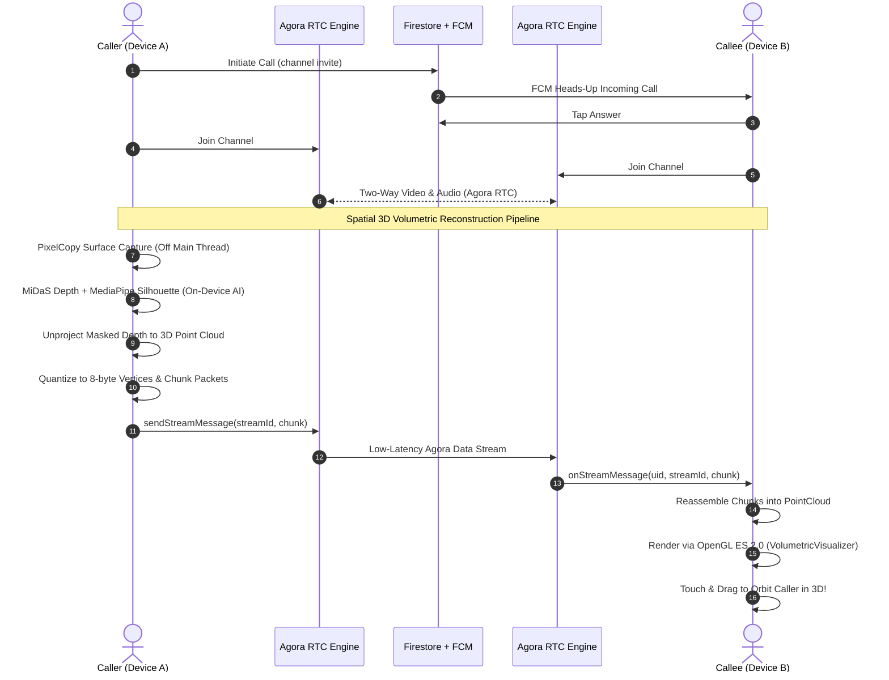

# 🌐 LiveVolume — Real-Time Spatial 3D Volumetric Calling

[](https://kotlinlang.org)
[](https://developer.android.com)
[](https://developer.android.com/jetpack/compose)
[](https://www.agora.io/)
[](https://www.tensorflow.org/lite)
[](https://www.khronos.org/opengles/)
[](https://firebase.google.com/)

**LiveVolume** transforms conventional 2D video calling into an interactive, spatial 3D volumetric experience on consumer mobile hardware. By coupling on-device neural depth estimation and silhouette segmentation with high-performance OpenGL ES 3D point cloud rendering and Agora RTC data streams, LiveVolume captures, reconstructs, streams, and renders live 3D holograms of callers in real time.

Developed for the **iQOO Hackathon**.

---

## 🚀 Key Features

- **Real-Time On-Device Depth Estimation (MiDaS AI)**: Runs monocular depth inference on camera frames using quantized `midas_small.tflite` with hardware acceleration delegates (NNAPI, GPU, and multi-threaded CPU fallback).
- **Foreground Silhouette Segmentation**: Integrates MediaPipe Selfie Segmentation (`selfie_segmentation.tflite`) to cleanly mask out background clutter, isolating only the caller's volumetric human geometry.
- **Interactive 3D Point Cloud Orbit Renderer**: Unprojects 2D masked depth and camera RGB into a 3D coordinate space (~6,000–12,000 colored vertices), rendered in custom OpenGL ES 2.0 with smooth touch drag-to-orbit and pinch-to-zoom controls.
- **Sub-Second Point Cloud Network Codec**: Quantizes $(X, Y, Z)$ positions into 16-bit signed shorts and colors into 16-bit RGB565 (8 bytes/point). Automatically fragments frames into $\le 1024$-byte chunked packets streamed across Agora RTC low-latency data streams and reassembled on the receiving device.
- **Two-Way Video & Audio (Agora RTC SDK)**: Native peer video streaming, PiP self-view, hardware camera switching (front/back), audio mute, speakerphone routing, and live decibel audio level metering.
- **Call Ringing & Handshake (Cloud Firestore + FCM)**: Real-time call invite documents and Firebase Cloud Messaging heads-up notifications with interactive *Answer* and *Decline* actions.
- **Clean 2D / 3D Experience (DESIGN.md Compliant)**: Sleek two-state pill toggle (`"2D"` vs `"3D"`) with zero technical jargon, floating HUD controls, and haptic feedback.
- **Hardened Performance Architecture**: Asynchronous model loading, hardware `PixelCopy` capture decoupled from the UI thread, dynamic latency clamping to prevent frame drops, and a hidden *Performance Fallback Mode* in Settings.

---

## 🏛️ End-to-End Pipeline Architecture



---

## 🧩 Technical Deep-Dive

### 1. Neural Depth & Segmentation Pipeline ([`DepthEstimator.kt`](file:///c:/Users/share/Documents/IQOO-Hackathon/IQOO-Hackathon-LiveVolume/app/src/main/java/com/example/ml/DepthEstimator.kt))
- **Model Buffer Allocation**: Direct memory-mapped buffers (`MappedByteBuffer`) load `midas_small.tflite` and `selfie_segmentation.tflite` from `assets/` without copying.
- **Delegate Fallback Matrix**: Tries Android NNAPI delegate $\rightarrow$ GPU delegate (`tensorflow-lite-gpu-api`) $\rightarrow$ 4-thread CPU fallback. All delegates catch `Throwable` to safeguard against native linkage errors.
- **Depth Masking**:
  $$\text{MaskedDepth}(x, y) = \begin{cases} \text{NormDepth}(x, y) & \text{if } \text{PersonMask}(x, y) \ge 0.5 \\ 0.0 & \text{otherwise} \end{cases}$$
- **Pinhole Camera Unprojection**:
  $$X = \frac{x - c_x}{f_x} \cdot Z, \quad Y = -\frac{y - c_y}{f_y} \cdot Z$$
  where disparity $Z = 0.75 + (1.0 - d) \times 1.15$ meters.

### 2. High-Performance Point Cloud Codec ([`PointCloudStreamer.kt`](file:///c:/Users/share/Documents/IQOO-Hackathon/IQOO-Hackathon-LiveVolume/app/src/main/java/com/example/util/PointCloudStreamer.kt))
- **8-Byte Quantization**:
  - $X, Y, Z$: Scaled float $\rightarrow$ Int16 (`short`), providing sub-millimeter spatial fidelity.
  - Color: 24-bit RGB888 $\rightarrow$ 16-bit RGB565 (`short`), cutting color bandwidth in half.
- **Packet Protocol**:
  - 8-Byte Header: `Magic (0x564C)`, `FrameId (UInt16)`, `ChunkIdx (UInt8)`, `TotalChunks (UInt8)`, `PointCount (UInt16)`.
  - Max 120 points per packet (960 bytes payload + 8 bytes header = 968 bytes $\le 1024$ bytes Agora MTU).
- **Reassembly Buffer**: Stateful ring-buffer reassembles unordered chunks by `FrameId` and emits complete frames to the 3D renderer.

### 3. OpenGL ES 2.0 Orbit Renderer ([`PointCloudRenderer.kt`](file:///c:/Users/share/Documents/IQOO-Hackathon/IQOO-Hackathon-LiveVolume/app/src/main/java/com/example/ui/components/PointCloudRenderer.kt))
- Native `GLSurfaceView.Renderer` with hardware depth testing (`GL_DEPTH_TEST`).
- Spherical camera coordinates: Pitch ($[-85^\circ, +85^\circ]$) and Yaw ($0^\circ - 360^\circ$) rotated around object center via touch gestures.
- Custom vertex shader scales point size by camera distance (`gl_PointSize = uPointSize / gl_Position.w`), and fragment shader renders smooth anti-aliased circular points with true RGB colors.

---

## 🛠️ Project Structure

```
app/src/main/
├── assets/
│   ├── midas_small.tflite          # MiDaS v2.1 Small on-device depth estimation
│   └── selfie_segmentation.tflite  # MediaPipe Selfie Segmentation human silhouette
├── java/com/example/
│   ├── data/
│   │   ├── local/                  # Room Database: AppDatabase, CallRecordEntity, CallHistoryDao
│   │   └── repository/             # CallSignalingRepository (Firestore & FCM)
│   ├── ml/
│   │   ├── DepthEstimator.kt       # On-device TFLite depth & segmentation inference pipeline
│   │   └── PointCloud.kt           # Geometry models
│   ├── model/                      # Session models, user entities, mesh modes
│   ├── service/                    # AudioProcessingService, LiveVolumeMessagingService (FCM)
│   ├── ui/
│   │   ├── components/             # VolumetricVisualizer, PointCloudRenderer, DepthDebugPreview
│   │   ├── screens/                # CallScreen, MainShellScreen, ContactsScreen, HistoryScreen, SettingsScreen
│   │   └── theme/                  # Color, Type, Theme tokens (DESIGN.md specification)
│   └── util/
│       ├── AgoraManager.kt         # Agora RTC Video Engine & Data Stream transport singleton
│       ├── PointCloudStreamer.kt   # Point cloud quantization & chunk reassembly codec
│       ├── HapticsManager.kt       # Tactile feedback orchestrator
│       └── InAppNotificationManager.kt
└── AndroidManifest.xml             # Camera, audio, internet & foreground permissions
```

---

## 📲 Getting Started

### Prerequisites
- **Android Studio Ladybug (2024.2+)** or newer
- **JDK 17** or **JDK 21**
- **Android SDK 35** (Minimum SDK: 26 / Android 8.0 Oreo)
- Physical Android device with camera & microphone (e.g., iQOO / Vivo device)

### Setup & Installation

1. **Clone the repository**:
   ```bash
   git clone https://github.com/haresh-sai06/IQOO-Hackathon-LiveVolume.git
   cd IQOO-Hackathon-LiveVolume
   ```

2. **Configure API Keys**:
   - Create or update `gradle.properties`:
     ```properties
     AGORA_APP_ID=your_agora_app_id_here
     ```
   - Place your `google-services.json` in `app/google-services.json` for Firebase authentication, Firestore signaling, and FCM push notifications.

3. **Build the project**:
   ```bash
   ./gradlew assembleDebug
   ```

4. **Install on connected device**:
   ```bash
   adb install -r ./app/build/outputs/apk/debug/app-debug.apk
   ```

5. **Launch LiveVolume**:
   ```bash
   adb shell am start -n com.aistudio.livevolume.vknrz/com.example.MainActivity
   ```

---

## 🎨 Design Guidelines

The app follows the design tokens outlined in `DESIGN.md`:
- **Primary Accent**: `LivePrimaryContainer` (`#2563EB`)
- **Success State**: `LiveSuccess` (`#10B981`)
- **Surface Elevation**: Dark HUD overlay (`#0F172A`) with rounded status bars and bottom action dock
- **Minimalist Controls**: 2-state pill toggle (`"2D"` / `"3D"`) with zero technical jargon visible to callers

---

## 📄 License

This project is licensed under the Apache License 2.0 - see the LICENSE file for details.
